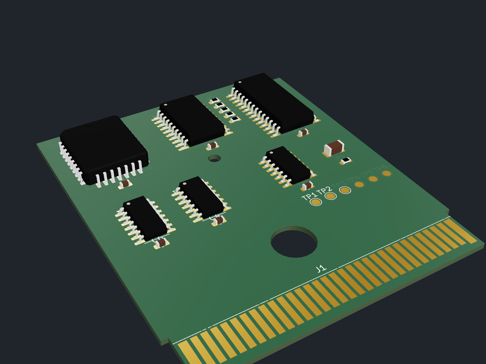
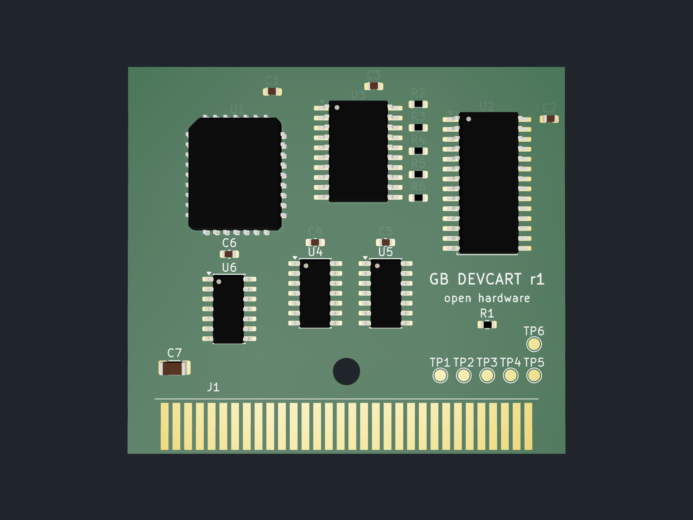
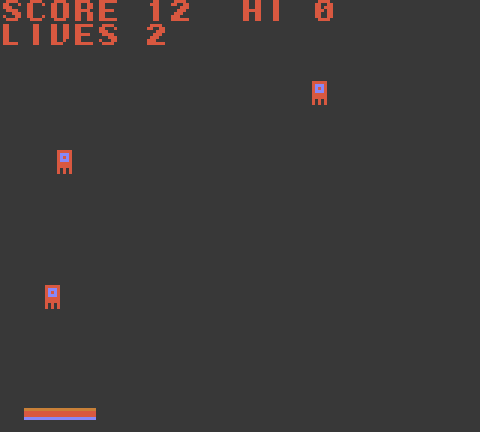

# GB DEVCART r1 — open hardware

A simple, original Game Boy (DMG) / ModRetro Chromatic homebrew development cartridge.
512 KB of rewritable NOR flash, 8 KB of battery-free F-RAM, and an MBC5-subset mapper built
from discrete 74HC logic. 2-layer, 56 x 49.5 mm, 32 edge fingers at 1.5 mm pitch, 5 V bus.



> **Status:** built, placed, ERC/DRC clean, every part with a 3D model, but **not routed** yet.
> The board has a complete ratsnest only; see "Project status" below.

Designed with [fabPlane](https://fabplane.com) (fabdesk) driving Claude Code. Inspired by the ModRetro
"Demo Cartridge", but an original, much simpler design: no FPGA, no level shifters, no regulators.

| What | Where |
| --- | --- |
| KiCad project (schematic, board, custom symbols/footprint) | `board.kicad_*`, `lib/`, `circuit.netlist.json` |
| 3D models of every part, 3D renders, STEP of the whole board | `3dmodels/`, `renders/`, `exports/board.step` |
| USB programmer (Arduino Mega firmware + PC tool + cart simulator) | [`programmer/`](programmer/README.md) |
| Demo homebrew game "Bit Catcher" (GBDK-2020) | [`game/`](game/README.md) |
| JLCPCB / LCSC price list | [`docs/jlcpcb-pricing.md`](docs/jlcpcb-pricing.md) |

## Quick start

```bash
# build the demo game (GBDK-2020)
make -C game GBDK_HOME=/path/to/gbdk
# test the programmer end to end against the cart simulator (no hardware needed)
programmer/test_e2e.sh
# flash a real cart through an Arduino Mega 2560 (see programmer/README.md for wiring)
python3 programmer/host/gbflash.py --port /dev/ttyACM0 flash game/dist/bitcatcher.gb
```

| Top | Bit Catcher on the cart |
| --- | --- |
|  |  |

## Memory map

| GB address    | Access | Function |
| ------------- | ------ | -------- |
| 0x0000–0x3FFF | R      | ROM bank 0 (fixed): flash 0x00000–0x03FFF |
| 0x4000–0x7FFF | R/W    | ROM bank N (switchable): flash `N*0x4000 + (addr & 0x3FFF)`, N = 0–31 |
| 0x2000–0x2FFF | W      | Bank register (74HC574, bits 0–4 used, bits 5–7 latched but unconnected) |
| 0xA000–0xBFFF | R/W    | 8 KB F-RAM (FM18W08, A13/A14 tied low), always enabled |

Notes:
- 0x3000–0x3FFF is deliberately **not** decoded, so MBC5 software that writes bit 8 there does not clobber the bank register.
- No RAM-enable register and no RAM bank latch. Upgrade path: use the FRAM's A13/A14 with a 2-bit latch.
- The bank register is undefined at power-up. Bank-0 code must write it before using 0x4000–0x7FFF.
- Writes to 0x4000–0x7FFF are the only ones that reach the flash /WE.

## Logic

| Signal | Equation |
| ------ | -------- |
| Flash /CE | `A15` |
| Flash /OE, FRAM /OE | `/RD` |
| Flash /WE | `/WR | A15 | /A14` (U5) |
| Latch clock (rising edge latches) | `/WR | A15 | A14 | A12 | /A13` (U4, U6) |
| Latch /OE | `/A14`; outputs are pulled down (2.2 kΩ), so A14=0 gives bank 0 |
| FRAM /CE | `/CS | A14 | /A13` (U5, U6) |
| FRAM /WE | `/WR` |

The flash sees `A0–A13` from the bus and `A14–A18` from the latch (`D0–D4`).

## Flashing from the Game Boy

Run the flasher from WRAM/HRAM, because the flash returns status instead of data while busy.
Interrupts off. All command cycles go through the switchable window, so bank-register writes at
0x2000 never reach the flash.

The SST39SF040 decodes commands on address bits A14–A0 only: `0x5555` and `0x2AAA`.
- `0x5555` needs chip A14 = 1, so select an **odd** bank (e.g. 1) and write to GB `0x5555`.
- `0x2AAA` needs chip A14 = 0, so select an **even** bank (e.g. 0) and write to GB `0x6AAA`.

Byte program of `data` to chip address `X`:
1. `[0x2000]=1;  [0x5555]=0xAA`
2. `[0x2000]=0;  [0x6AAA]=0x55`
3. `[0x2000]=1;  [0x5555]=0xA0`
4. `[0x2000]=X>>14;  [0x4000 + (X & 0x3FFF)]=data`
5. Poll the same address until DQ7 equals data bit 7 (or DQ6 stops toggling), about 20 µs.

Sector erase (4 KB) at `SA`: the same first two cycles, then `[0x2000]=1; [0x5555]=0x80`,
`[0x5555]=0xAA`, `[0x2000]=0; [0x6AAA]=0x55`, then `[0x2000]=SA>>14; [0x4000+(SA&0x3FFF)]=0x30`.
Chip erase: the same, with the last cycle `[0x2000]=1; [0x5555]=0x10`. Then poll as above.

Program a 16 KB bank only from a bank other than the one being written, or from RAM, and verify by
read-back. Keep bank 0 (vectors, header, flasher stub) write-protected by software convention.

## Hardware notes

- `/RESET` has a 10 kΩ pull-up (R1). `AUDIO_IN` is unconnected except for test pad TP6.
- Test pads: TP1 VCC, TP2 GND, TP3 CLK, TP4 /WR, TP5 /RD, TP6 AUDIO_IN.
- Edge fingers are on the component side, 0.5 mm back from the board edge; order the board with ENIG.
- Pin 1 (VCC) is at the left, looking at the component side. Order: VCC, CLK, /WR, /RD, /CS, A0–A15, D0–D7, /RESET, AUDIO_IN, GND.
- 3.5 mm boss hole at (28, 39) mm from the top-left; all parts are kept above y = 41.5 mm.
- Latch outputs are tri-stated and pulled down for bank 0, so the bank-0 address-to-data path depends on a ~2.2 kΩ RC settle (about 40–80 ns). Check the timing on a real console.
- The `/CS` decode assumes `/CS` is asserted for A15 = 1; verify on the target hardware.
- Bus is 5 V logic (HC family). Confirm that your target's cartridge port tolerates 5 V.

## BOM

| Ref | Qty | Value | Package | Suggested MPN |
| --- | --- | ----- | ------- | ------------- |
| U1 | 1 | 512 KB 5 V NOR flash | PLCC-32 | SST39SF040-70-4C-NHE |
| U2 | 1 | 32 KB F-RAM | SOIC-28W | FM18W08-SG |
| U3 | 1 | 74HC574 | SOIC-20W | SN74HC574DWR |
| U4, U5 | 2 | 74HC32 | SOIC-14 | SN74HC32DR |
| U6 | 1 | 74HC00 | SOIC-14 | SN74HC00DR |
| C1–C6 | 6 | 100 nF X7R | 0603 | — |
| C7 | 1 | 10 µF X5R | 1206 | — |
| R1 | 1 | 10 kΩ | 0603 | — |
| R2–R6 | 5 | 2.2 kΩ | 0603 | — |
| TP1–TP6 | 6 | test pad D1.5 mm | — | — |
| J1 | 1 | edge fingers (PCB feature) | `gbdev:GB_Cart_Edge_32` | — |

## Programming over USB

The cart is programmed by an **Arduino Mega 2560** (5 V I/O, so no level shifters) wired to a
32-pin Game Boy cartridge slot. The PC runs `programmer/host/gbflash.py`
(`info`, `flash`, `dump`, `erase`, `save-backup`, `save-restore`). The flashing algorithm lives in
`programmer/firmware/gbflash/gbflash_core.h`, which also compiles into a native simulator of this
cart for hardware-free tests. See [`programmer/README.md`](programmer/README.md) for the wiring table.

## 3D models

Every component carries a 3D model, vendored in `3dmodels/` and referenced as
`${KIPRJMOD}/3dmodels/…`, so the project renders and exports (STEP/GLB) with no global KiCad
3D library. The passives and SOIC models come from the official KiCad 3D library
(CC-BY-SA 4.0 with the KiCad library exception). KiCad ships no PLCC-32 model, so
`scripts/make_plcc32_model.py` generates one with CadQuery (JEDEC MS-016 body, 32 J-leads)
matching the KiCad footprint. Regenerate the renders with:

```bash
kicad-cli pcb export glb --include-pads --include-silkscreen --include-soldermask -o renders/board.glb board.kicad_pcb
kicad-cli pcb export step -o exports/board.step board.kicad_pcb
cd scripts/render3d && npm install && CHROMIUM_PATH=/path/to/chrome npm run render  # -> renders/3d-*.png
```

## Ordering

See [`docs/jlcpcb-pricing.md`](docs/jlcpcb-pricing.md) for bare-PCB and assembled prices at
JLCPCB with LCSC part numbers. Order ENIG (or hard-gold fingers with a 45° bevel) and **1.0 mm**
thickness so the board fits a standard DMG cartridge shell. **Route the board first**: the
current revision is unrouted.

Snapshot from 2026-10-01 (USD, before shipping):

| Qty | Bare PCB, ENIG | PCB + Economic assembly |
| --- | --- | --- |
| 5 | $18.60 ($3.72/board) | ~$129 (~$25.75/board) |
| 10 | $21.60 ($2.16/board) | ~$215 (~$21.46/board) |
| 30 | $28.90 ($0.96/board) | ~$496 (~$16.55/board) |
| 100 | $62.70 ($0.63/board) | ~$1,497 (~$14.97/board) |

Before ordering:
- **Stock.** The exact flash and F-RAM are out of stock at LCSC. Use the drop-in SST39SF040-55-4I-NHE-T
  (C632847) and FM18W08-SGTR (C55945). The F-RAM is about 60% of the assembled cost.
- **Gold-finger size rule.** JLC's bevelled gold-finger option needs boards of at least 50 mm on both sides.
  This board is 49.5 mm tall, so widen it to 50 mm (r1.1) or order a panel. Plain ENIG needs no change.

## Project files

- `scripts/gen.py` generates `lib/gbdev.kicad_sym`, `lib/gbdev.pretty/` and `circuit.netlist.json`. The netlist is the source of truth; `board.kicad_*` are built from it.
- Symbols and the edge footprint are custom (`gbdev` library) because the build environment has no KiCad symbol libraries.

## Project status

- Done: netlist (26 components, 46 nets), custom symbol/footprint libraries, `circuit_build`, placement
  inside the 56 x 49.5 mm outline (all parts above y = 41.5 mm, 3.5 mm boss hole at (28, 39)), top render.
- **ERC** (`reports/erc.json`): 0 errors, 0 warnings.
- **DRC** (`reports/drc.json`): 0 violations, 0 schematic-parity conflicts, **134 unrouted connections**
  (the ratsnest of a board with no copper).
- **Routing: not done.** `route_run` with the `capacity` router fails immediately
  (`Cannot find package '@fabplane/fab-router'`), and Freerouting's jar is not installed. The board is left
  unrouted with the ratsnest. Routing needs one of those routers installed, or manual routing in KiCad.
  Expect to use both copper layers; the fingers are on F.Cu, so the data/address bus needs vias to B.Cu.
- Board thickness is the KiCad default (1.6 mm). The netlist format has no thickness field and it was
  deliberately not changed; set 1.0 mm in the fab order or in KiCad's board setup.
- The "GB DEVCART r1" / "open hardware" silkscreen and the J1 reference-text position were added to
  `board.kicad_pcb` by hand. A `circuit_build` with `fresh: true` will discard them.
- During review, the generated schematic merged four net pairs (e.g. A13 with WR_N) because the tall flash and
  F-RAM symbols overlapped the gate chips below them on the generator's grid. The symbols were rebalanced
  (16/16 and 14/14 pins per side) in `lib/gbdev.kicad_sym` and `scripts/gen.py`. The library file was edited
  by hand; `gen.py` was updated to match but has not been re-run since.
