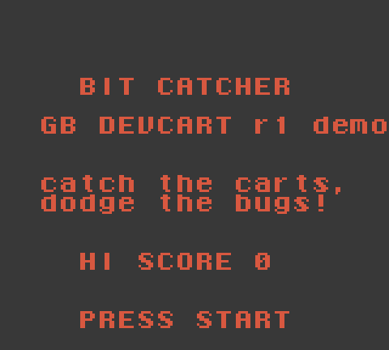
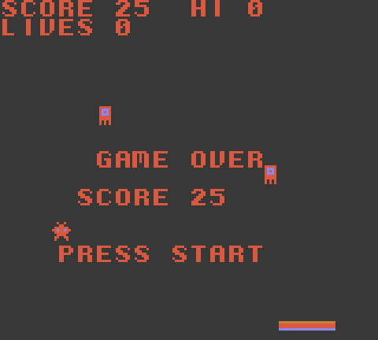

# Bit Catcher

A tiny homebrew game for the GB DEVCART r1, written in C with
[GBDK-2020](https://github.com/gbdk-2020/gbdk-2020). Catch the falling cartridges, dodge the bugs.
Missing a cartridge or catching a bug costs a life. The speed goes up every 8 catches, and the
high score is kept in the cart's F-RAM, so it survives power-off without a battery.

| Title | In game | Game over |
| --- | --- | --- |
|  |  |  |

## Build

```bash
# GBDK-2020 4.x: download gbdk-linux64.tar.gz (or the macOS/Windows build) and unpack it
make GBDK_HOME=/path/to/gbdk          # -> dist/bitcatcher.gb (32 KB)
```

The ROM header says MBC5 + RAM + battery (`0x1B`), 32 KB ROM and 8 KB RAM. The devcart uses
the same bank register (`0x2000`) and RAM window (`0xA000`), so the ROM runs unchanged in
emulators (BGB, SameBoy, mGBA, PyBoy) and on the cart. It is also flagged CGB-compatible, so it
runs on a Game Boy Color or ModRetro Chromatic.

## Devcart-specific details

- **Bank latch at boot.** The 74HC574 bank latch powers up with random contents, so `main()`
  writes `1` to `0x2000` first. All of the game's code and data sits in bank 0 (below `0x1600`,
  see `build/bitcatcher.map`), so nothing runs from the switchable window before that write.
- **Saves.** The high score is stored as `"GBDC"` plus a 16-bit value at `0xA000`. On the
  devcart the F-RAM is always enabled; the `ENABLE_RAM` write to `0x0000` is only there for
  emulators.

## Test

```bash
pip install pyboy
python3 test_pyboy.py   # boots headless, plays with a simple bot, checks the high score persists
```

## Put it on the cart

```bash
python3 ../programmer/host/gbflash.py --port /dev/ttyACM0 flash dist/bitcatcher.gb
```
