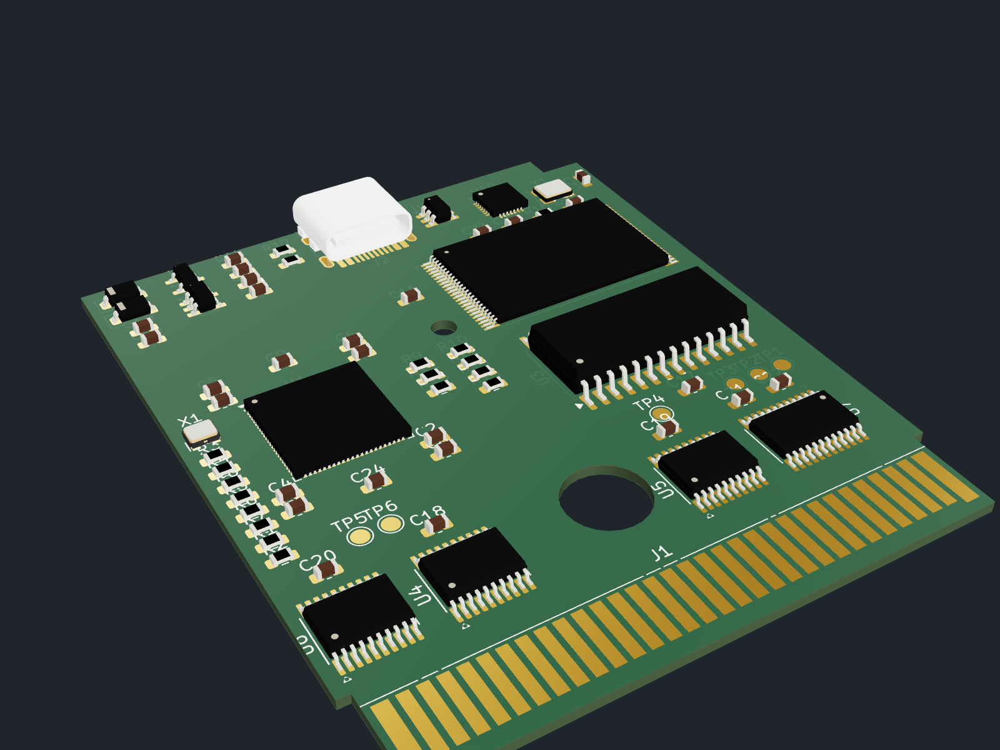
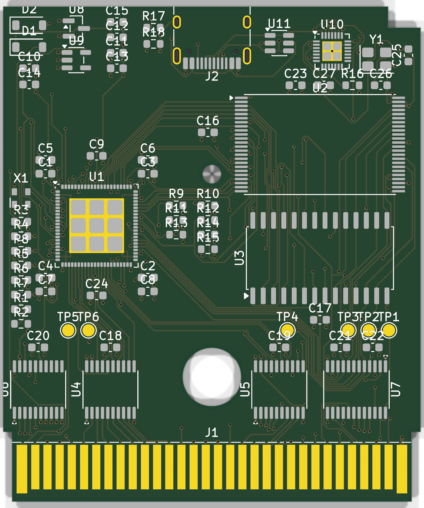
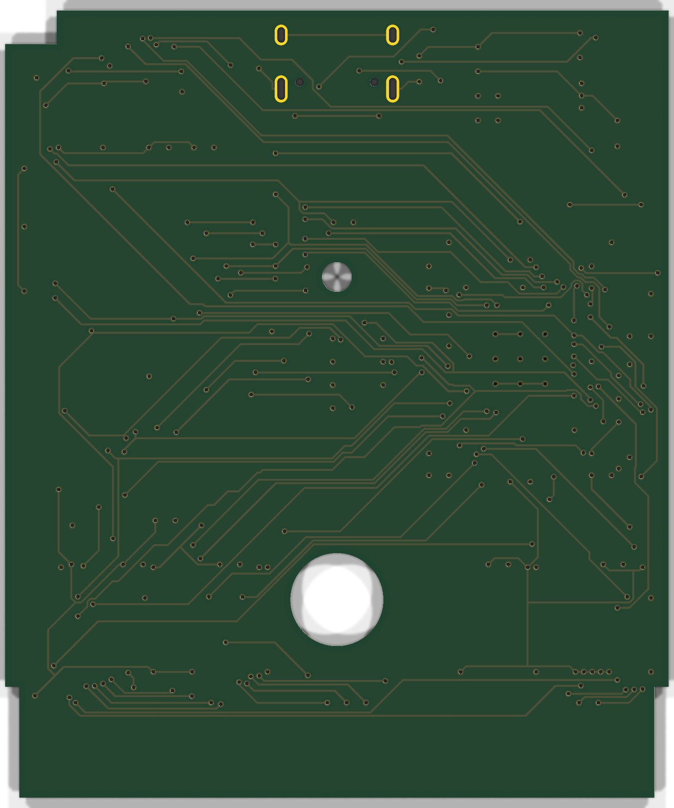

# GB DEVCART r2.1 — FPGA mapper + USB-C board

A Game Boy / ModRetro Chromatic dev cart with a Gowin GW1N-LV4 FPGA as the mapper (MBC5 + locked dev
mode, `r2/rtl/`), 8 MB S29GL064N flash, 32 KB FM28V020 F-RAM, 5 V ↔ 3.3 V bus transceivers, and a
CH347F USB-C bridge. The bridge programs the flash through the FPGA (`programmer/host/gbflash.py --usb`)
and loads the FPGA over JTAG (`openFPGALoader -c ch347_jtag`). Parts and pinouts: `docs/r2-parts.md`.

> **Status:** placed and fully routed in fabdesk, DRC clean, fit check passes.
> **Not built or tested on hardware.**

## Board

- Standard DMG cartridge outline: 51.4 × 61 mm, finger tongue, lock notch, Ø7.2 / Ø2.3 shell holes.
  Fits a DMG / GBC / Analogue Pocket / ModRetro Chromatic cartridge shell. The USB-C receptacle needs
  the r2 shell from `mech/` (`shell_back_usb` + `shell_front_usb`), which opens the top wall over it.
- 4 layers, 1.0 mm: F.Cu signals, In1.Cu solid GND plane, In2.Cu 3V3 plane, B.Cu signals. Signals
  were routed on F.Cu and B.Cu only (one RAM_NCE hop on In2.Cu), so both planes stay whole.
- Every part on the label side, inside the shell's component zone; nothing on the back.
- J2 USB-C is centred on the top edge, its mouth 1.2 mm past the board edge.
- Rules: 0.15 mm tracks (0.1 mm neck-downs), 0.1 mm clearance (the QFN-88 pads sit 0.1 mm apart),
  0.5 / 0.3 mm vias, 0.2 mm hole clearance. JLCPCB's 4-layer process allows 0.09 mm.

## Results

- `kicad-cli pcb drc --schematic-parity`: 0 errors, 0 unconnected, 0 parity issues. 108 warnings,
  all silkscreen (overlapping or clipped reference text).
- `python3 mech/fit_check.py r2.1=r2/board/board.kicad_pcb`: every check passes.
- 68 parts, 116 nets, 2 planes, about 120 plane vias. Freerouting routed all 181 signal connections.

## How it was built

1. `r2/hw/gen_r2.py` writes `circuit.netlist.json` with the DMG outline, shell holes and placement
   from `r2/hw/layout_dmg.py`. That file also checks the placement: no courtyard overlaps, everything in
   the shell zone, clear of the notch and the holes.
2. fabdesk `circuit_build`, then `circuit_place` for the rotations.
3. `r2/hw/power_vias.py`: a via next to every GND / 3V3 pad (a via grid in the QFN exposed pads), plus
   the In1 / In2 planes, through fabdesk's `native_edit_transaction`.
4. Copper keep-outs around the shell holes and the USB-C pegs (`fab_api.hole_keepouts`).
5. fabdesk `route_run` with Freerouting on the signal nets, restricted to F.Cu and B.Cu
   (`settings: {layers: [3, 34]}`), then a few local fixes: ground hops into the FPGA's exposed pad,
   RAM_NCE re-routed with In2 allowed.
6. Planes refilled with 0.3 mm thermal spokes; DRC with `kicad-cli`.

## Order files

`exports/jlcpcb/` (regenerate with `KICAD_CLI=… BOARD_DIR=r2/board python3 scripts/jlc_export.py`):

| File | Upload as |
| --- | --- |
| `gerbers.zip` | Gerbers, 4 layers, 1.0 mm, 51.4 × 61 mm |
| `bom.csv` | Assembly BOM, 21 lines with LCSC numbers |
| `cpl.csv` | Pick and place, 61 parts, top side |

Order ENIG or hard-gold fingers. Check the rotation preview on JLC's assembly page.

3D models: the parts use KiCad's library models, vendored in `../../3dmodels/`. KiCad has none for the
HRO TYPE-C-31-M-12, so `scripts/make_usbc_model.py` generates a simplified one. The 2.5 × 2.0 mm
oscillator uses the Epson SG210 model, which has the same package.

| Top | Bottom |
| --- | --- |
|  |  |
